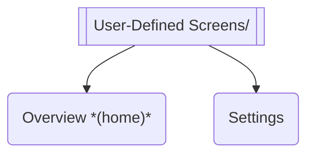
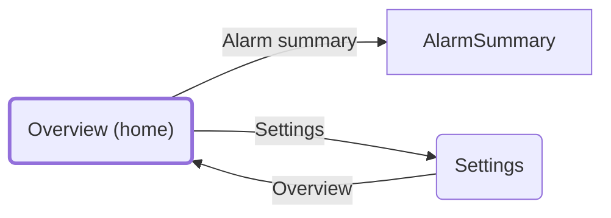

<!-- generated by lf docs build from the ConveyorDemo spec (spec 5336a8a4c6d44005) on 2026-09-28; do not edit, change the spec and rebuild -->

# ConveyorDemo_HMI - screen hierarchy and navigation

Source: hmi/hmi.json. Terminal: 2715P-T10CD. Home screen: `User-Defined Screens\Overview`. Controller reference(s): `LGX`. 2 user screens, 1 folders, 1 Add-On Graphics.

## Screen hierarchy (folders)

| Screen | Folder | Banner | Security | Add-On Graphics | Bindings | Navigates to |
|---|---|---|---|---|---|---|
| Overview | User-Defined Screens | yes |  | AOG_UDT_Motor | 7 | AlarmSummary, Settings |
| Settings | User-Defined Screens | yes |  |  | 3 | Overview |

## Navigation menu (shortcuts)

| Caption | Target |
|---|---|
| Conveyor 01 - Overview | `User-Defined Screens\Overview` |
| Conveyor 01 - Settings | `User-Defined Screens\Settings` |

## Navigation graph

Solid arrows = navigation buttons on the screen; dashed = popups. Predefined screens are shown as boxes; the banner targets are omitted to keep the graph readable.

## Checks

- Reachable from home/menu/banner: 2 of 2 user screens.
- Unreachable screens (no shortcut, no banner entry, no button leads here): none.
- Navigation targets that do not exist: none.

## Add-On Graphics usage

| Add-On Graphic | Used on |
|---|---|
| AOG_UDT_Motor | Overview |

## Tag bindings per screen

Top-level controller tags each screen reads or writes (members collapsed). Full list per tag in HMI_TAGS.md.

| Screen | Bindings | Tags |
|---|---|---|
| Overview | 7 | Alarms, HMI_Conveyor01, I_ESTOP_OK, Sim_Mode, Sys_AlarmAck, Sys_HeartBeat |
| Settings | 3 | HMI_Conveyor01, Sim_Mode |
