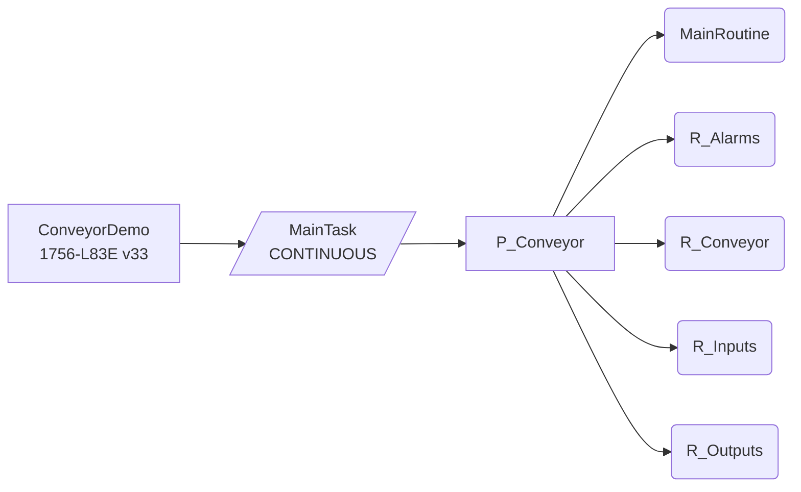
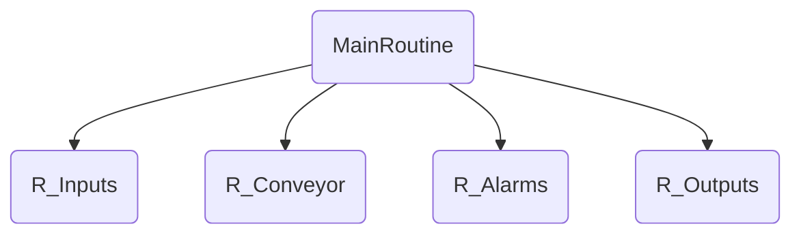

<!-- generated by lf docs build from the ConveyorDemo spec (spec 5336a8a4c6d44005) on 2026-09-28; do not edit, change the spec and rebuild -->

# ConveyorDemo - tasks, programs and routines

## Structure

## Tasks

| Task | Type | Rate ms | Priority | Watchdog ms | Programs | Description |
|---|---|---|---|---|---|---|
| MainTask | CONTINUOUS |  | 10 | 500 | P_Conveyor | Main continuous task |

## Program P_Conveyor

Conveyor 01 control: input mapping, motor control, alarms, output mapping

Main routine `MainRoutine`.

| Routine | Language | Size | Calls | Description |
|---|---|---|---|---|
| MainRoutine | RLL | 5 rungs | R_Inputs, R_Conveyor, R_Alarms, R_Outputs | Main routine: calls sub-routines in scan order (inputs -> control -> alarms -> outputs) |
| R_Alarms | ST | 13 lines |  | Alarm evaluation (Structured Text). Alarm bits live in the controller tag 'Alarms'; tag-based alarm conditions (alarms.json) give them messages for the HMI. |
| R_Conveyor | RLL | 10 rungs |  | Conveyor 01 motor control |
| R_Inputs | RLL | 5 rungs |  | Map physical inputs to program tags (single place to invert/debounce) |
| R_Outputs | RLL | 3 rungs |  | Map program tags to physical outputs (last routine in scan; all outputs gated by safety, blocked in simulation) |

### MainRoutine rung index

| Rung | Comment | Instructions |
|---|---|---|
| 0 | First-scan flag from controller status bit | OTE XIC |
| 1 | Input mapping | JSR |
| 2 | Conveyor control | JSR |
| 3 | Alarm handling (Structured Text) | JSR |
| 4 | Output mapping | JSR |

### R_Conveyor rung index

| Rung | Comment | Instructions |
|---|---|---|
| 0 | Start request: local pushbutton or HMI command, only when safety OK | OTE XIC |
| 1 | Stop request: local stop pressed, HMI stop, or E-stop | OTE XIC XIO |
| 2 | Fault delay configuration from HMI | MOV |
| 3 | Motor control block | AOI_Motor |
| 4 | Ready status for HMI | OTE XIC XIO |
| 5 | Clear momentary HMI commands once consumed | OTU XIC |
| 6 |  | OTU XIC XIO |
| 7 |  | OTU XIC XIO |
| 8 | Run-hour accumulator: 1 h retentive timer, add 1.0 h on DN then reset | RTO XIC |
| 9 |  | ADD RES XIC |

### R_Inputs rung index

| Rung | Comment | Instructions |
|---|---|---|
| 0 |  | OTE XIC |
| 1 | Stop PB is normally closed: healthy = 1 | OTE XIC |
| 2 |  | OTE XIC |
| 3 | 1 Hz heartbeat for HMI watchdog | TON XIO |
| 4 |  | OTE XIC |

### R_Outputs rung index

| Rung | Comment | Instructions |
|---|---|---|
| 0 |  | OTE XIC XIO |
| 1 | Simulation: contactor aux follows the run command after 300 ms | TON XIC |
| 2 |  | OTE XIC |

## Add-On Instruction logic

| AOI | Routine | Language | Size | Description |
|---|---|---|---|---|
| AOI_Motor | Logic | RLL | 5 rungs | AOI_Motor main logic |
