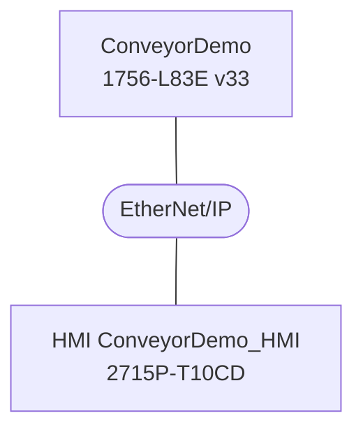

<!-- generated by lf docs build from the ConveyorDemo spec (spec 5336a8a4c6d44005) on 2026-09-28; do not edit, change the spec and rebuild -->

# ConveyorDemo - system overview

Inventory and architecture derived from the project. The purpose of the system, the process it controls and the operating philosophy are described in SPEC.md; this document says what the system is made of and how it is connected.

## 1. Identification

| Item | Value |
|---|---|
| Controller | `ConveyorDemo` |
| Processor | 1756-L83E |
| Firmware / Logix version | v33.11 (software 33.00) |
| Safety controller | no |
| Description | LogixForge demo: one conveyor with start/stop, feedback fault and HMI interface |
| HMI | ConveyorDemo_HMI on 2715P-T10CD; home screen `Overview` |
| Size | 2 UDTs, 1 AOIs, 0 modules, 11 controller tags, 1 programs / 5 routines, 1 tasks, 3 alarms |

## 2. Architecture

## 3. Hardware inventory

(no I/O modules in the project; add Studio 5000 module exports to `modules/`)

## 4. Networks and communication interfaces

No remote devices, message instructions or produced/consumed tags found.

## 5. Control software

| Task | Type | Rate | Programs (routines) |
|---|---|---|---|
| MainTask | CONTINUOUS | - | P_Conveyor (5) |

Add-On Instructions: 1 (0 project/site, 1 vendor). Details in TAGS.md and ROUTINES.md.
User-defined data types: UDT_Alarms, UDT_Motor.

## 6. Operator interface

HMI project `ConveyorDemo_HMI` on 2715P-T10CD: 2 screens in 1 folders, 2 menu shortcuts, 1 Add-On Graphics. Screen hierarchy and navigation in HMI_NAVIGATION.md; tag interface in HMI_TAGS.md.
Controller alarms: 3 tag-based alarm conditions (ALARMS.csv).

## 7. External data interface (controller-scope tags)

Tags other systems (HMI, SCADA/EPICS, peer controllers) can address. Program-scope tags are not externally addressable by most clients.

| Tag | Type | Dim | External access | Description |
|---|---|---|---|---|
| HMI_Conveyor01 | UDT_Motor |  | Read/Write | HMI interface for conveyor 01 |
| Alarms | UDT_Alarms |  | Read/Write | Line alarm bits (tag-based alarm conditions attached) |
| Sys_HeartBeat | BOOL |  | Read/Write | 1 Hz heartbeat for HMI watchdog |
| Sys_FirstScan | BOOL |  | Read/Write | True for the first scan after power-up/download |
| Sys_AlarmAck | BOOL |  | Read/Write | Global alarm acknowledge from HMI |
| Sim_Mode | BOOL |  | Read/Write | Simulation mode: feedback simulated, physical outputs blocked |
| I_PB_Start | BOOL |  | Read/Write | Local start pushbutton (NO). TODO: alias_for Local:2:I.Data.0 once I/O module XML is added |
| I_PB_Stop | BOOL |  | Read/Write | Local stop pushbutton (NC, 1 = healthy). TODO: alias_for Local:2:I.Data.1 |
| I_ESTOP_OK | BOOL |  | Read/Write | E-stop circuit healthy from safety relay. TODO: alias_for Local:2:I.Data.2 |
| I_Conveyor01_Aux | BOOL |  | Read/Write | Conveyor 01 contactor auxiliary contact. TODO: alias_for Local:2:I.Data.3 |
| O_Conveyor01_Run | BOOL |  | Read/Write | Conveyor 01 contactor coil. TODO: alias_for Local:3:O.Data.0 |

## 8. Document set

Generated documents:

| File | Content |
|---|---|
| SPEC.md | functional description (hand-written) |
| IO_LIST.md | modules and I/O points |
| IO_LIST.csv | I/O points (spreadsheet) |
| TAGS.md | UDTs, AOIs, tags |
| ROUTINES.md | task/program/routine map |
| INTERLOCKS.md | cause and effect from the logic |
| HMI_TAGS.md | HMI tag interface |
| ALARMS.csv | alarm list |
| TEST_PLAN.md | test plan skeleton |
| HMI_NAVIGATION.md | HMI screen hierarchy and navigation |
| SYSTEM.md | this overview |
| README.md | index |
