<!-- generated by lf docs build from the R00 spec (spec 16b3f30f4ab13fee) on 2026-09-28; do not edit, change the spec and rebuild -->

# masterHMI - screen hierarchy and navigation

Source: View Designer export. Terminal: 15" PanelView 5510 2715P-T15CD. Home screen: `User-Defined Screens\HOME`. Controller reference(s): `masterCode`. 42 user screens, 13 folders, 17 Add-On Graphics.

## Screen hierarchy (folders)

```mermaid
flowchart TD
  n_Predefined_Screens[["Predefined Screens/"]]
  n_User_Defined_Screens[["User-Defined Screens/"]]
  n_User_Defined_Screens_Calibration[["Calibration/"]]
  n_User_Defined_Screens --> n_User_Defined_Screens_Calibration
  n_User_Defined_Screens_Calibration_System1[["System1/"]]
  n_User_Defined_Screens_Calibration --> n_User_Defined_Screens_Calibration_System1
  n_User_Defined_Screens_Calibration_System2[["System2/"]]
  n_User_Defined_Screens_Calibration --> n_User_Defined_Screens_Calibration_System2
  n_User_Defined_Screens_Configuration[["Configuration/"]]
  n_User_Defined_Screens --> n_User_Defined_Screens_Configuration
  n_User_Defined_Screens_Configuration_System1[["System1/"]]
  n_User_Defined_Screens_Configuration --> n_User_Defined_Screens_Configuration_System1
  n_User_Defined_Screens_Configuration_System2[["System2/"]]
  n_User_Defined_Screens_Configuration --> n_User_Defined_Screens_Configuration_System2
  n_User_Defined_Screens_Details[["Details/"]]
  n_User_Defined_Screens --> n_User_Defined_Screens_Details
  n_User_Defined_Screens_Documents[["Documents/"]]
  n_User_Defined_Screens --> n_User_Defined_Screens_Documents
  n_User_Defined_Screens_External_Subsystems[["External_Subsystems/"]]
  n_User_Defined_Screens --> n_User_Defined_Screens_External_Subsystems
  n_User_Defined_Screens_Menus[["Menus/"]]
  n_User_Defined_Screens --> n_User_Defined_Screens_Menus
  n_User_Defined_Screens_Trends[["Trends/"]]
  n_User_Defined_Screens --> n_User_Defined_Screens_Trends
  n_User_Defined_Screens --> n_User_Defined_Screens_HOME("HOME *(home)*")
  n_User_Defined_Screens --> n_User_Defined_Screens_HOME_Prev("HOME_Prev")
  n_User_Defined_Screens_Calibration --> n_User_Defined_Screens_Calibration_Calib_HP_RF_Chain("Calib_HP_RF_Chain")
  n_User_Defined_Screens_Calibration_System1 --> n_User_Defined_Screens_Calibration_System1_Calib_Cavity_LCW("Calib_Cavity_LCW")
  n_User_Defined_Screens_Calibration_System1 --> n_User_Defined_Screens_Calibration_System1_Calib_Cavity_Temp("Calib_Cavity_Temp")
  n_User_Defined_Screens_Calibration_System1 --> n_User_Defined_Screens_Calibration_System1_Calib_RF_Power("Calib_RF_Power")
  n_User_Defined_Screens_Calibration_System2 --> n_User_Defined_Screens_Calibration_System2_Calib_Cavity_LCW("Calib_Cavity_LCW")
  n_User_Defined_Screens_Calibration_System2 --> n_User_Defined_Screens_Calibration_System2_Calib_Cavity_Temp("Calib_Cavity_Temp")
  n_User_Defined_Screens_Calibration_System2 --> n_User_Defined_Screens_Calibration_System2_Calib_RF_Power("Calib_RF_Power")
  n_User_Defined_Screens_Configuration --> n_User_Defined_Screens_Configuration_Config_Arc_Detectors("Config_Arc_Detectors")
  n_User_Defined_Screens_Configuration --> n_User_Defined_Screens_Configuration_Config_HP_RF_Chain("Config_HP_RF_Chain")
  n_User_Defined_Screens_Configuration --> n_User_Defined_Screens_Configuration_Config_System("Config_System")
  n_User_Defined_Screens_Configuration_System1 --> n_User_Defined_Screens_Configuration_System1_Config_Cavity_LCW("Config_Cavity_LCW")
  n_User_Defined_Screens_Configuration_System1 --> n_User_Defined_Screens_Configuration_System1_Config_Cavity_Temp("Config_Cavity_Temp")
  n_User_Defined_Screens_Configuration_System1 --> n_User_Defined_Screens_Configuration_System1_Config_RF_Power("Config_RF_Power")
  n_User_Defined_Screens_Configuration_System1 --> n_User_Defined_Screens_Configuration_System1_LLRF_Analog_Config("LLRF_Analog_Config")
  n_User_Defined_Screens_Configuration_System2 --> n_User_Defined_Screens_Configuration_System2_Config_Cavity_LCW("Config_Cavity_LCW")
  n_User_Defined_Screens_Configuration_System2 --> n_User_Defined_Screens_Configuration_System2_Config_Cavity_Temp("Config_Cavity_Temp")
  n_User_Defined_Screens_Configuration_System2 --> n_User_Defined_Screens_Configuration_System2_Config_RF_Power("Config_RF_Power")
  n_User_Defined_Screens_Configuration_System2 --> n_User_Defined_Screens_Configuration_System2_LLRF_Analog_Config("LLRF_Analog_Config")
  n_User_Defined_Screens_Details --> n_User_Defined_Screens_Details_Arc_Detectors("Arc_Detectors")
  n_User_Defined_Screens_Details --> n_User_Defined_Screens_Details_Auxilliary("Auxilliary")
  n_User_Defined_Screens_Details --> n_User_Defined_Screens_Details_Cavity("Cavity")
  n_User_Defined_Screens_Details --> n_User_Defined_Screens_Details_Cavity_LCW("Cavity_LCW")
  n_User_Defined_Screens_Details --> n_User_Defined_Screens_Details_Cavity_Temp("Cavity_Temp")
  n_User_Defined_Screens_Details --> n_User_Defined_Screens_Details_HP_Coax_Switch("HP_Coax_Switch")
  n_User_Defined_Screens_Details --> n_User_Defined_Screens_Details_HP_RF_Chain("HP_RF_Chain")
  n_User_Defined_Screens_Details --> n_User_Defined_Screens_Details_LLRF1_Analog("LLRF1_Analog")
  n_User_Defined_Screens_Details --> n_User_Defined_Screens_Details_LLRF2_Analog("LLRF2_Analog")
  n_User_Defined_Screens_Details --> n_User_Defined_Screens_Details_RF_Power("RF_Power")
  n_User_Defined_Screens_Details --> n_User_Defined_Screens_Details_TCU("TCU")
  n_User_Defined_Screens_Details --> n_User_Defined_Screens_Details_Tuner1("Tuner1")
  n_User_Defined_Screens_Details --> n_User_Defined_Screens_Details_Tuner2("Tuner2")
  n_User_Defined_Screens_Documents --> n_User_Defined_Screens_Documents_Manual("Manual")
  n_User_Defined_Screens_External_Subsystems --> n_User_Defined_Screens_External_Subsystems_MPS("MPS")
  n_User_Defined_Screens_External_Subsystems --> n_User_Defined_Screens_External_Subsystems_PPS("PPS")
  n_User_Defined_Screens_External_Subsystems --> n_User_Defined_Screens_External_Subsystems_Vacuum("Vacuum")
  n_User_Defined_Screens_Menus --> n_User_Defined_Screens_Menus_Menu_Calibration("Menu_Calibration")
  n_User_Defined_Screens_Menus --> n_User_Defined_Screens_Menus_Menu_Configuration("Menu_Configuration")
  n_User_Defined_Screens_Menus --> n_User_Defined_Screens_Menus_Menu_Details("Menu_Details")
  n_User_Defined_Screens_Menus --> n_User_Defined_Screens_Menus_Menu_Main("Menu_Main")
  n_User_Defined_Screens_Trends --> n_User_Defined_Screens_Trends_Vacuum("Vacuum")
```



| Screen | Folder | Banner | Security | Add-On Graphics | Bindings | Navigates to |
|---|---|---|---|---|---|---|
| Calib_HP_RF_Chain | User-Defined Screens\Calibration | no |  | UDT_ai_Calib | 10 | ControllersGeneral, HOME, Menu_Calibration, NetworkDiagnostic |
| Calib_Cavity_LCW | User-Defined Screens\Calibration\System1 | no |  | UDT_ai_Calib | 30 | ControllersGeneral, HOME, Menu_Calibration, NetworkDiagnostic |
| Calib_Cavity_Temp | User-Defined Screens\Calibration\System1 | no |  | UDT_ai_Calib | 10 | ControllersGeneral, HOME, Menu_Calibration, NetworkDiagnostic |
| Calib_RF_Power | User-Defined Screens\Calibration\System1 | no |  | UDT_RF_Power_Calib | 10 | ControllersGeneral, HOME, Menu_Calibration, NetworkDiagnostic |
| Calib_Cavity_LCW | User-Defined Screens\Calibration\System2 | no |  | UDT_ai_Calib | 30 | ControllersGeneral, HOME, Menu_Calibration, NetworkDiagnostic |
| Calib_Cavity_Temp | User-Defined Screens\Calibration\System2 | no |  | UDT_ai_Calib | 10 | ControllersGeneral, HOME, Menu_Calibration, NetworkDiagnostic |
| Calib_RF_Power | User-Defined Screens\Calibration\System2 | no |  | UDT_RF_Power_Calib | 10 | ControllersGeneral, HOME, Menu_Calibration, NetworkDiagnostic |
| Config_Arc_Detectors | User-Defined Screens\Configuration | no |  | UDT_ArcDet_Config | 7 | ControllersGeneral, HOME, Menu_Configuration, NetworkDiagnostic |
| Config_HP_RF_Chain | User-Defined Screens\Configuration | no |  | UDT_ai_Config | 10 | ControllersGeneral, HOME, Menu_Configuration, NetworkDiagnostic |
| Config_System | User-Defined Screens\Configuration | no | Operator=ReadOnly, Engineer=FullAccess |  | 4 | ControllersGeneral, HOME, Menu_Configuration, NetworkDiagnostic |
| Config_Cavity_LCW | User-Defined Screens\Configuration\System1 | no |  | UDT_ai_Config | 30 | ControllersGeneral, HOME, Menu_Configuration, NetworkDiagnostic |
| Config_Cavity_Temp | User-Defined Screens\Configuration\System1 | no |  | UDT_ai_Config | 10 | ControllersGeneral, HOME, Menu_Configuration, NetworkDiagnostic |
| Config_RF_Power | User-Defined Screens\Configuration\System1 | no |  | UDT_RF_Power_Config | 11 | ControllersGeneral, HOME, Menu_Configuration, NetworkDiagnostic |
| LLRF_Analog_Config | User-Defined Screens\Configuration\System1 | no |  |  | 15 | ControllersGeneral, HOME, Menu_Configuration, NetworkDiagnostic |
| Config_Cavity_LCW | User-Defined Screens\Configuration\System2 | no |  | UDT_ai_Config | 30 | ControllersGeneral, HOME, Menu_Configuration, NetworkDiagnostic |
| Config_Cavity_Temp | User-Defined Screens\Configuration\System2 | no |  | UDT_ai_Config | 10 | ControllersGeneral, HOME, Menu_Configuration, NetworkDiagnostic |
| Config_RF_Power | User-Defined Screens\Configuration\System2 | no |  | UDT_RF_Power_Config | 11 | ControllersGeneral, HOME, Menu_Configuration, NetworkDiagnostic |
| LLRF_Analog_Config | User-Defined Screens\Configuration\System2 | no |  |  | 15 | ControllersGeneral, HOME, Menu_Configuration, NetworkDiagnostic |
| Arc_Detectors | User-Defined Screens\Details | no |  | LED_Fault_Square, UDT_ArcDet | 11 | ControllersGeneral, HOME, NetworkDiagnostic |
| Auxilliary | User-Defined Screens\Details | no |  | LED_Fault_Square, UDT_bi | 27 | ControllersGeneral, HOME, NetworkDiagnostic |
| Cavity | User-Defined Screens\Details | no |  | LED_Fault_Square, UDT_bi | 22 | Cavity_LCW, Cavity_Temp, ControllersGeneral, HOME, NetworkDiagnostic, Tuner1 |
| Cavity_LCW | User-Defined Screens\Details | no |  | LED_Fault_Square, UDT_ai | 66 | ControllersGeneral, HOME, NetworkDiagnostic |
| Cavity_Temp | User-Defined Screens\Details | no |  | LED_Fault_Square, UDT_ai | 24 | ControllersGeneral, HOME, NetworkDiagnostic |
| HP_Coax_Switch | User-Defined Screens\Details | no |  | LED_Fault_Square, LED_Status, LED_Status_Inverse, UDT_bi | 29 | ControllersGeneral, HOME, NetworkDiagnostic |
| HP_RF_Chain | User-Defined Screens\Details | no |  | LED_Fault_Square, UDT_ai, UDT_bi | 20 | ControllersGeneral, HOME, HP_Coax_Switch, NetworkDiagnostic, TCU |
| LLRF1_Analog | User-Defined Screens\Details | no |  |  | 3 | ControllersGeneral, HOME, NetworkDiagnostic |
| LLRF2_Analog | User-Defined Screens\Details | no |  |  | 3 | ControllersGeneral, HOME, NetworkDiagnostic |
| RF_Power | User-Defined Screens\Details | no |  | LED_Fault_Square, UDT_RF_Power | 25 | ControllersGeneral, HOME, NetworkDiagnostic |
| TCU | User-Defined Screens\Details | no |  | LED_Status, UDT_bi | 16 | ControllersGeneral, HOME, NetworkDiagnostic |
| Tuner1 | User-Defined Screens\Details | no |  | LED_Fault_Square, UDT_bi | 43 | ControllersGeneral, HOME, NetworkDiagnostic, Tuner2 |
| Tuner2 | User-Defined Screens\Details | no |  | LED_Fault_Square, UDT_bi | 43 | ControllersGeneral, HOME, NetworkDiagnostic, Tuner1 |
| Manual | User-Defined Screens\Documents | no |  | PDF_Viewer_Landscape | 0 | ControllersGeneral, NetworkDiagnostic |
| MPS | User-Defined Screens\External_Subsystems | no |  | LED_Fault_Square, LED_Status, UDT_bi | 8 | ControllersGeneral, HOME, NetworkDiagnostic |
| PPS | User-Defined Screens\External_Subsystems | no |  | LED_Fault_Circle, LED_Status, UDT_bi | 37 | ControllersGeneral, HOME, NetworkDiagnostic |
| Vacuum | User-Defined Screens\External_Subsystems | no |  | LED_Fault_Square, UDT_bi | 10 | ControllersGeneral, HOME, NetworkDiagnostic |
| HOME | User-Defined Screens | no |  | LED_Fault_Circle, LED_Fault_Square, LED_Status, UDT_bi | 59 | Arc_Detectors, Auxilliary, Cavity, ControllersGeneral, HP_RF_Chain, LLRF1_Analog, LLRF2_Analog, MPS, Menu_Main, NetworkDiagnostic, PPS, RF_Power, Vacuum |
| HOME_Prev | User-Defined Screens | no |  | LED_Fault_Circle, LED_Fault_Square, UDT_bi | 48 | Arc_Detectors, Auxilliary, Cavity, ControllersGeneral, HOME, HP_RF_Chain, LLRF1_Analog, LLRF2_Analog, MPS, Menu_Main, NetworkDiagnostic, PPS, RF_Power, Vacuum |
| Menu_Calibration | User-Defined Screens\Menus | no |  |  | 0 | Calib_Cavity_LCW, Calib_Cavity_Temp, Calib_HP_RF_Chain, Calib_RF_Power, ControllersGeneral, HOME, Menu_Main, NetworkDiagnostic |
| Menu_Configuration | User-Defined Screens\Menus | no |  |  | 0 | Config_Arc_Detectors, Config_Cavity_LCW, Config_Cavity_Temp, Config_HP_RF_Chain, Config_RF_Power, Config_System, ControllersGeneral, HOME, Menu_Main, NetworkDiagnostic |
| Menu_Details | User-Defined Screens\Menus | no |  |  | 1 | Arc_Detectors, Cavity_LCW, Cavity_Temp, ControllersGeneral, HOME, HP_Coax_Switch, HP_RF_Chain, LLRF1_Analog, LLRF2_Analog, MPS, Menu_Main, NetworkDiagnostic, PPS, RF_Power, Tuner1, Tuner2, Vacuum |
| Menu_Main | User-Defined Screens\Menus | no |  |  | 0 | ControllersGeneral, HOME, Menu_Calibration, Menu_Configuration, Menu_Details, NetworkDiagnostic |
| Vacuum | User-Defined Screens\Trends | no |  |  | 1 | ControllersGeneral, HOME, NetworkDiagnostic |

## Navigation menu (shortcuts)

| Caption | Target |
|---|---|
| HOME | `User-Defined Screens\HOME` |
| Settings | `Predefined Screens\Settings` |

## Banner (available from every screen)

| Target |
|---|
| `Navigation Menu\AlarmSummary` |
| `Navigation Menu\AutomaticDiagnostics` |
| `Predefined Screens\ControllersGeneral` |
| `Predefined Screens\DataLog` |
| `Predefined Screens\NetworkDiagnostic` |
| `Predefined Screens\WarningsAndErrors` |

## Navigation graph

Solid arrows = navigation buttons on the screen; dashed = popups. Predefined screens are shown as boxes; the banner targets are omitted to keep the graph readable.

```mermaid
flowchart LR
  n_User_Defined_Screens_Calibration_Calib_HP_RF_Chain("Calib_HP_RF_Chain")
  n_User_Defined_Screens_Calibration_System1_Calib_Cavity_LCW("Calib_Cavity_LCW")
  n_User_Defined_Screens_Calibration_System1_Calib_Cavity_Temp("Calib_Cavity_Temp")
  n_User_Defined_Screens_Calibration_System1_Calib_RF_Power("Calib_RF_Power")
  n_User_Defined_Screens_Calibration_System2_Calib_Cavity_LCW("Calib_Cavity_LCW")
  n_User_Defined_Screens_Calibration_System2_Calib_Cavity_Temp("Calib_Cavity_Temp")
  n_User_Defined_Screens_Calibration_System2_Calib_RF_Power("Calib_RF_Power")
  n_User_Defined_Screens_Configuration_Config_Arc_Detectors("Config_Arc_Detectors")
  n_User_Defined_Screens_Configuration_Config_HP_RF_Chain("Config_HP_RF_Chain")
  n_User_Defined_Screens_Configuration_Config_System("Config_System")
  n_User_Defined_Screens_Configuration_System1_Config_Cavity_LCW("Config_Cavity_LCW")
  n_User_Defined_Screens_Configuration_System1_Config_Cavity_Temp("Config_Cavity_Temp")
  n_User_Defined_Screens_Configuration_System1_Config_RF_Power("Config_RF_Power")
  n_User_Defined_Screens_Configuration_System1_LLRF_Analog_Config("LLRF_Analog_Config")
  n_User_Defined_Screens_Configuration_System2_Config_Cavity_LCW("Config_Cavity_LCW")
  n_User_Defined_Screens_Configuration_System2_Config_Cavity_Temp("Config_Cavity_Temp")
  n_User_Defined_Screens_Configuration_System2_Config_RF_Power("Config_RF_Power")
  n_User_Defined_Screens_Configuration_System2_LLRF_Analog_Config("LLRF_Analog_Config")
  n_User_Defined_Screens_Details_Arc_Detectors("Arc_Detectors")
  n_User_Defined_Screens_Details_Auxilliary("Auxilliary")
  n_User_Defined_Screens_Details_Cavity("Cavity")
  n_User_Defined_Screens_Details_Cavity_LCW("Cavity_LCW")
  n_User_Defined_Screens_Details_Cavity_Temp("Cavity_Temp")
  n_User_Defined_Screens_Details_HP_Coax_Switch("HP_Coax_Switch")
  n_User_Defined_Screens_Details_HP_RF_Chain("HP_RF_Chain")
  n_User_Defined_Screens_Details_LLRF1_Analog("LLRF1_Analog")
  n_User_Defined_Screens_Details_LLRF2_Analog("LLRF2_Analog")
  n_User_Defined_Screens_Details_RF_Power("RF_Power")
  n_User_Defined_Screens_Details_TCU("TCU")
  n_User_Defined_Screens_Details_Tuner1("Tuner1")
  n_User_Defined_Screens_Details_Tuner2("Tuner2")
  n_User_Defined_Screens_Documents_Manual("Manual")
  n_User_Defined_Screens_External_Subsystems_MPS("MPS")
  n_User_Defined_Screens_External_Subsystems_PPS("PPS")
  n_User_Defined_Screens_External_Subsystems_Vacuum("Vacuum")
  n_User_Defined_Screens_HOME("HOME (home)")
  n_User_Defined_Screens_HOME_Prev("HOME_Prev")
  n_User_Defined_Screens_Menus_Menu_Calibration("Menu_Calibration")
  n_User_Defined_Screens_Menus_Menu_Configuration("Menu_Configuration")
  n_User_Defined_Screens_Menus_Menu_Details("Menu_Details")
  n_User_Defined_Screens_Menus_Menu_Main("Menu_Main")
  n_User_Defined_Screens_Trends_Vacuum("Vacuum")
  n_Predefined_Screens_ControllersGeneral["ControllersGeneral"]
  n_User_Defined_Screens_Calibration_Calib_HP_RF_Chain --> n_Predefined_Screens_ControllersGeneral
  n_Predefined_Screens_NetworkDiagnostic["NetworkDiagnostic"]
  n_User_Defined_Screens_Calibration_Calib_HP_RF_Chain --> n_Predefined_Screens_NetworkDiagnostic
  n_User_Defined_Screens_Calibration_Calib_HP_RF_Chain --> n_User_Defined_Screens_HOME
  n_User_Defined_Screens_Calibration_Calib_HP_RF_Chain --> n_User_Defined_Screens_Menus_Menu_Calibration
  n_User_Defined_Screens_Calibration_System1_Calib_Cavity_LCW --> n_Predefined_Screens_ControllersGeneral
  n_User_Defined_Screens_Calibration_System1_Calib_Cavity_LCW --> n_Predefined_Screens_NetworkDiagnostic
  n_User_Defined_Screens_Calibration_System1_Calib_Cavity_LCW --> n_User_Defined_Screens_HOME
  n_User_Defined_Screens_Calibration_System1_Calib_Cavity_LCW --> n_User_Defined_Screens_Menus_Menu_Calibration
  n_User_Defined_Screens_Calibration_System1_Calib_Cavity_Temp --> n_Predefined_Screens_ControllersGeneral
  n_User_Defined_Screens_Calibration_System1_Calib_Cavity_Temp --> n_Predefined_Screens_NetworkDiagnostic
  n_User_Defined_Screens_Calibration_System1_Calib_Cavity_Temp --> n_User_Defined_Screens_HOME
  n_User_Defined_Screens_Calibration_System1_Calib_Cavity_Temp --> n_User_Defined_Screens_Menus_Menu_Calibration
  n_User_Defined_Screens_Calibration_System1_Calib_RF_Power --> n_Predefined_Screens_ControllersGeneral
  n_User_Defined_Screens_Calibration_System1_Calib_RF_Power --> n_Predefined_Screens_NetworkDiagnostic
  n_User_Defined_Screens_Calibration_System1_Calib_RF_Power --> n_User_Defined_Screens_HOME
  n_User_Defined_Screens_Calibration_System1_Calib_RF_Power --> n_User_Defined_Screens_Menus_Menu_Calibration
  n_User_Defined_Screens_Calibration_System2_Calib_Cavity_LCW --> n_Predefined_Screens_ControllersGeneral
  n_User_Defined_Screens_Calibration_System2_Calib_Cavity_LCW --> n_Predefined_Screens_NetworkDiagnostic
  n_User_Defined_Screens_Calibration_System2_Calib_Cavity_LCW --> n_User_Defined_Screens_HOME
  n_User_Defined_Screens_Calibration_System2_Calib_Cavity_LCW --> n_User_Defined_Screens_Menus_Menu_Calibration
  n_User_Defined_Screens_Calibration_System2_Calib_Cavity_Temp --> n_Predefined_Screens_ControllersGeneral
  n_User_Defined_Screens_Calibration_System2_Calib_Cavity_Temp --> n_Predefined_Screens_NetworkDiagnostic
  n_User_Defined_Screens_Calibration_System2_Calib_Cavity_Temp --> n_User_Defined_Screens_HOME
  n_User_Defined_Screens_Calibration_System2_Calib_Cavity_Temp --> n_User_Defined_Screens_Menus_Menu_Calibration
  n_User_Defined_Screens_Calibration_System2_Calib_RF_Power --> n_Predefined_Screens_ControllersGeneral
  n_User_Defined_Screens_Calibration_System2_Calib_RF_Power --> n_Predefined_Screens_NetworkDiagnostic
  n_User_Defined_Screens_Calibration_System2_Calib_RF_Power --> n_User_Defined_Screens_HOME
  n_User_Defined_Screens_Calibration_System2_Calib_RF_Power --> n_User_Defined_Screens_Menus_Menu_Calibration
  n_User_Defined_Screens_Configuration_Config_Arc_Detectors --> n_Predefined_Screens_ControllersGeneral
  n_User_Defined_Screens_Configuration_Config_Arc_Detectors --> n_Predefined_Screens_NetworkDiagnostic
  n_User_Defined_Screens_Configuration_Config_Arc_Detectors --> n_User_Defined_Screens_HOME
  n_User_Defined_Screens_Configuration_Config_Arc_Detectors --> n_User_Defined_Screens_Menus_Menu_Configuration
  n_User_Defined_Screens_Configuration_Config_HP_RF_Chain --> n_Predefined_Screens_ControllersGeneral
  n_User_Defined_Screens_Configuration_Config_HP_RF_Chain --> n_Predefined_Screens_NetworkDiagnostic
  n_User_Defined_Screens_Configuration_Config_HP_RF_Chain --> n_User_Defined_Screens_HOME
  n_User_Defined_Screens_Configuration_Config_HP_RF_Chain --> n_User_Defined_Screens_Menus_Menu_Configuration
  n_User_Defined_Screens_Configuration_Config_System --> n_Predefined_Screens_ControllersGeneral
  n_User_Defined_Screens_Configuration_Config_System --> n_Predefined_Screens_NetworkDiagnostic
  n_User_Defined_Screens_Configuration_Config_System --> n_User_Defined_Screens_HOME
  n_User_Defined_Screens_Configuration_Config_System --> n_User_Defined_Screens_Menus_Menu_Configuration
  n_User_Defined_Screens_Configuration_System1_Config_Cavity_LCW --> n_Predefined_Screens_ControllersGeneral
  n_User_Defined_Screens_Configuration_System1_Config_Cavity_LCW --> n_Predefined_Screens_NetworkDiagnostic
  n_User_Defined_Screens_Configuration_System1_Config_Cavity_LCW --> n_User_Defined_Screens_HOME
  n_User_Defined_Screens_Configuration_System1_Config_Cavity_LCW --> n_User_Defined_Screens_Menus_Menu_Configuration
  n_User_Defined_Screens_Configuration_System1_Config_Cavity_Temp --> n_Predefined_Screens_ControllersGeneral
  n_User_Defined_Screens_Configuration_System1_Config_Cavity_Temp --> n_Predefined_Screens_NetworkDiagnostic
  n_User_Defined_Screens_Configuration_System1_Config_Cavity_Temp --> n_User_Defined_Screens_HOME
  n_User_Defined_Screens_Configuration_System1_Config_Cavity_Temp --> n_User_Defined_Screens_Menus_Menu_Configuration
  n_User_Defined_Screens_Configuration_System1_Config_RF_Power --> n_Predefined_Screens_ControllersGeneral
  n_User_Defined_Screens_Configuration_System1_Config_RF_Power --> n_Predefined_Screens_NetworkDiagnostic
  n_User_Defined_Screens_Configuration_System1_Config_RF_Power --> n_User_Defined_Screens_HOME
  n_User_Defined_Screens_Configuration_System1_Config_RF_Power --> n_User_Defined_Screens_Menus_Menu_Configuration
  n_User_Defined_Screens_Configuration_System1_LLRF_Analog_Config --> n_Predefined_Screens_ControllersGeneral
  n_User_Defined_Screens_Configuration_System1_LLRF_Analog_Config --> n_Predefined_Screens_NetworkDiagnostic
  n_User_Defined_Screens_Configuration_System1_LLRF_Analog_Config --> n_User_Defined_Screens_HOME
  n_User_Defined_Screens_Configuration_System1_LLRF_Analog_Config --> n_User_Defined_Screens_Menus_Menu_Configuration
  n_User_Defined_Screens_Configuration_System2_Config_Cavity_LCW --> n_Predefined_Screens_ControllersGeneral
  n_User_Defined_Screens_Configuration_System2_Config_Cavity_LCW --> n_Predefined_Screens_NetworkDiagnostic
  n_User_Defined_Screens_Configuration_System2_Config_Cavity_LCW --> n_User_Defined_Screens_HOME
  n_User_Defined_Screens_Configuration_System2_Config_Cavity_LCW --> n_User_Defined_Screens_Menus_Menu_Configuration
  n_User_Defined_Screens_Configuration_System2_Config_Cavity_Temp --> n_Predefined_Screens_ControllersGeneral
  n_User_Defined_Screens_Configuration_System2_Config_Cavity_Temp --> n_Predefined_Screens_NetworkDiagnostic
  n_User_Defined_Screens_Configuration_System2_Config_Cavity_Temp --> n_User_Defined_Screens_HOME
  n_User_Defined_Screens_Configuration_System2_Config_Cavity_Temp --> n_User_Defined_Screens_Menus_Menu_Configuration
  n_User_Defined_Screens_Configuration_System2_Config_RF_Power --> n_Predefined_Screens_ControllersGeneral
  n_User_Defined_Screens_Configuration_System2_Config_RF_Power --> n_Predefined_Screens_NetworkDiagnostic
  n_User_Defined_Screens_Configuration_System2_Config_RF_Power --> n_User_Defined_Screens_HOME
  n_User_Defined_Screens_Configuration_System2_Config_RF_Power --> n_User_Defined_Screens_Menus_Menu_Configuration
  n_User_Defined_Screens_Configuration_System2_LLRF_Analog_Config --> n_Predefined_Screens_ControllersGeneral
  n_User_Defined_Screens_Configuration_System2_LLRF_Analog_Config --> n_Predefined_Screens_NetworkDiagnostic
  n_User_Defined_Screens_Configuration_System2_LLRF_Analog_Config --> n_User_Defined_Screens_HOME
  n_User_Defined_Screens_Configuration_System2_LLRF_Analog_Config --> n_User_Defined_Screens_Menus_Menu_Configuration
  n_User_Defined_Screens_Details_Arc_Detectors --> n_Predefined_Screens_ControllersGeneral
  n_User_Defined_Screens_Details_Arc_Detectors --> n_Predefined_Screens_NetworkDiagnostic
  n_User_Defined_Screens_Details_Arc_Detectors --> n_User_Defined_Screens_HOME
  n_User_Defined_Screens_Details_Auxilliary --> n_Predefined_Screens_ControllersGeneral
  n_User_Defined_Screens_Details_Auxilliary --> n_Predefined_Screens_NetworkDiagnostic
  n_User_Defined_Screens_Details_Auxilliary --> n_User_Defined_Screens_HOME
  n_User_Defined_Screens_Details_Cavity --> n_Predefined_Screens_ControllersGeneral
  n_User_Defined_Screens_Details_Cavity --> n_Predefined_Screens_NetworkDiagnostic
  n_User_Defined_Screens_Details_Cavity --> n_User_Defined_Screens_Details_Cavity_LCW
  n_User_Defined_Screens_Details_Cavity --> n_User_Defined_Screens_Details_Cavity_Temp
  n_User_Defined_Screens_Details_Cavity --> n_User_Defined_Screens_Details_Tuner1
  n_User_Defined_Screens_Details_Cavity --> n_User_Defined_Screens_HOME
  n_User_Defined_Screens_Details_Cavity_LCW --> n_Predefined_Screens_ControllersGeneral
  n_User_Defined_Screens_Details_Cavity_LCW --> n_Predefined_Screens_NetworkDiagnostic
  n_User_Defined_Screens_Details_Cavity_LCW --> n_User_Defined_Screens_HOME
  n_User_Defined_Screens_Details_Cavity_Temp --> n_Predefined_Screens_ControllersGeneral
  n_User_Defined_Screens_Details_Cavity_Temp --> n_Predefined_Screens_NetworkDiagnostic
  n_User_Defined_Screens_Details_Cavity_Temp --> n_User_Defined_Screens_HOME
  n_User_Defined_Screens_Details_HP_Coax_Switch --> n_Predefined_Screens_ControllersGeneral
  n_User_Defined_Screens_Details_HP_Coax_Switch --> n_Predefined_Screens_NetworkDiagnostic
  n_User_Defined_Screens_Details_HP_Coax_Switch --> n_User_Defined_Screens_HOME
  n_User_Defined_Screens_Details_HP_RF_Chain --> n_Predefined_Screens_ControllersGeneral
  n_User_Defined_Screens_Details_HP_RF_Chain --> n_Predefined_Screens_NetworkDiagnostic
  n_User_Defined_Screens_Details_HP_RF_Chain --> n_User_Defined_Screens_Details_HP_Coax_Switch
  n_User_Defined_Screens_Details_HP_RF_Chain --> n_User_Defined_Screens_Details_TCU
  n_User_Defined_Screens_Details_HP_RF_Chain --> n_User_Defined_Screens_HOME
  n_User_Defined_Screens_Details_LLRF1_Analog --> n_Predefined_Screens_ControllersGeneral
  n_User_Defined_Screens_Details_LLRF1_Analog --> n_Predefined_Screens_NetworkDiagnostic
  n_User_Defined_Screens_Details_LLRF1_Analog --> n_User_Defined_Screens_HOME
  n_User_Defined_Screens_Details_LLRF2_Analog --> n_Predefined_Screens_ControllersGeneral
  n_User_Defined_Screens_Details_LLRF2_Analog --> n_Predefined_Screens_NetworkDiagnostic
  n_User_Defined_Screens_Details_LLRF2_Analog --> n_User_Defined_Screens_HOME
  n_User_Defined_Screens_Details_RF_Power --> n_Predefined_Screens_ControllersGeneral
  n_User_Defined_Screens_Details_RF_Power --> n_Predefined_Screens_NetworkDiagnostic
  n_User_Defined_Screens_Details_RF_Power --> n_User_Defined_Screens_HOME
  n_User_Defined_Screens_Details_TCU --> n_Predefined_Screens_ControllersGeneral
  n_User_Defined_Screens_Details_TCU --> n_Predefined_Screens_NetworkDiagnostic
  n_User_Defined_Screens_Details_TCU --> n_User_Defined_Screens_HOME
  n_User_Defined_Screens_Details_Tuner1 --> n_Predefined_Screens_ControllersGeneral
  n_User_Defined_Screens_Details_Tuner1 --> n_Predefined_Screens_NetworkDiagnostic
  n_User_Defined_Screens_Details_Tuner1 --> n_User_Defined_Screens_Details_Tuner2
  n_User_Defined_Screens_Details_Tuner1 --> n_User_Defined_Screens_HOME
  n_User_Defined_Screens_Details_Tuner2 --> n_Predefined_Screens_ControllersGeneral
  n_User_Defined_Screens_Details_Tuner2 --> n_Predefined_Screens_NetworkDiagnostic
  n_User_Defined_Screens_Details_Tuner2 --> n_User_Defined_Screens_Details_Tuner1
  n_User_Defined_Screens_Details_Tuner2 --> n_User_Defined_Screens_HOME
  n_User_Defined_Screens_Documents_Manual --> n_Predefined_Screens_ControllersGeneral
  n_User_Defined_Screens_Documents_Manual --> n_Predefined_Screens_NetworkDiagnostic
  n_User_Defined_Screens_External_Subsystems_MPS --> n_Predefined_Screens_ControllersGeneral
  n_User_Defined_Screens_External_Subsystems_MPS --> n_Predefined_Screens_NetworkDiagnostic
  n_User_Defined_Screens_External_Subsystems_MPS --> n_User_Defined_Screens_HOME
  n_User_Defined_Screens_External_Subsystems_PPS --> n_Predefined_Screens_ControllersGeneral
  n_User_Defined_Screens_External_Subsystems_PPS --> n_Predefined_Screens_NetworkDiagnostic
  n_User_Defined_Screens_External_Subsystems_PPS --> n_User_Defined_Screens_HOME
  n_User_Defined_Screens_External_Subsystems_Vacuum --> n_Predefined_Screens_ControllersGeneral
  n_User_Defined_Screens_External_Subsystems_Vacuum --> n_Predefined_Screens_NetworkDiagnostic
  n_User_Defined_Screens_External_Subsystems_Vacuum --> n_User_Defined_Screens_HOME
  n_User_Defined_Screens_HOME --> n_Predefined_Screens_ControllersGeneral
  n_User_Defined_Screens_HOME --> n_Predefined_Screens_NetworkDiagnostic
  n_User_Defined_Screens_HOME --> n_User_Defined_Screens_Details_Arc_Detectors
  n_User_Defined_Screens_HOME --> n_User_Defined_Screens_Details_Auxilliary
  n_User_Defined_Screens_HOME --> n_User_Defined_Screens_Details_Cavity
  n_User_Defined_Screens_HOME --> n_User_Defined_Screens_Details_HP_RF_Chain
  n_User_Defined_Screens_HOME --> n_User_Defined_Screens_Details_LLRF1_Analog
  n_User_Defined_Screens_HOME --> n_User_Defined_Screens_Details_LLRF2_Analog
  n_User_Defined_Screens_HOME --> n_User_Defined_Screens_Details_RF_Power
  n_User_Defined_Screens_HOME --> n_User_Defined_Screens_External_Subsystems_MPS
  n_User_Defined_Screens_HOME --> n_User_Defined_Screens_External_Subsystems_PPS
  n_User_Defined_Screens_HOME --> n_User_Defined_Screens_External_Subsystems_Vacuum
  n_User_Defined_Screens_HOME --> n_User_Defined_Screens_Menus_Menu_Main
  n_User_Defined_Screens_HOME_Prev --> n_Predefined_Screens_ControllersGeneral
  n_User_Defined_Screens_HOME_Prev --> n_Predefined_Screens_NetworkDiagnostic
  n_User_Defined_Screens_HOME_Prev --> n_User_Defined_Screens_Details_Arc_Detectors
  n_User_Defined_Screens_HOME_Prev --> n_User_Defined_Screens_Details_Auxilliary
  n_User_Defined_Screens_HOME_Prev --> n_User_Defined_Screens_Details_Cavity
  n_User_Defined_Screens_HOME_Prev --> n_User_Defined_Screens_Details_HP_RF_Chain
  n_User_Defined_Screens_HOME_Prev --> n_User_Defined_Screens_Details_LLRF1_Analog
  n_User_Defined_Screens_HOME_Prev --> n_User_Defined_Screens_Details_LLRF2_Analog
  n_User_Defined_Screens_HOME_Prev --> n_User_Defined_Screens_Details_RF_Power
  n_User_Defined_Screens_HOME_Prev --> n_User_Defined_Screens_External_Subsystems_MPS
  n_User_Defined_Screens_HOME_Prev --> n_User_Defined_Screens_External_Subsystems_PPS
  n_User_Defined_Screens_HOME_Prev --> n_User_Defined_Screens_External_Subsystems_Vacuum
  n_User_Defined_Screens_HOME_Prev --> n_User_Defined_Screens_HOME
  n_User_Defined_Screens_HOME_Prev --> n_User_Defined_Screens_Menus_Menu_Main
  n_User_Defined_Screens_Menus_Menu_Calibration --> n_Predefined_Screens_ControllersGeneral
  n_User_Defined_Screens_Menus_Menu_Calibration --> n_Predefined_Screens_NetworkDiagnostic
  n_User_Defined_Screens_Menus_Menu_Calibration --> n_User_Defined_Screens_Calibration_Calib_HP_RF_Chain
  n_User_Defined_Screens_Menus_Menu_Calibration --> n_User_Defined_Screens_Calibration_System1_Calib_Cavity_LCW
  n_User_Defined_Screens_Menus_Menu_Calibration --> n_User_Defined_Screens_Calibration_System1_Calib_Cavity_Temp
  n_User_Defined_Screens_Menus_Menu_Calibration --> n_User_Defined_Screens_Calibration_System1_Calib_RF_Power
  n_User_Defined_Screens_Menus_Menu_Calibration --> n_User_Defined_Screens_Calibration_System2_Calib_Cavity_LCW
  n_User_Defined_Screens_Menus_Menu_Calibration --> n_User_Defined_Screens_Calibration_System2_Calib_Cavity_Temp
  n_User_Defined_Screens_Menus_Menu_Calibration --> n_User_Defined_Screens_Calibration_System2_Calib_RF_Power
  n_User_Defined_Screens_Menus_Menu_Calibration --> n_User_Defined_Screens_HOME
  n_User_Defined_Screens_Menus_Menu_Calibration --> n_User_Defined_Screens_Menus_Menu_Main
  n_User_Defined_Screens_Menus_Menu_Configuration --> n_Predefined_Screens_ControllersGeneral
  n_User_Defined_Screens_Menus_Menu_Configuration --> n_Predefined_Screens_NetworkDiagnostic
  n_User_Defined_Screens_Menus_Menu_Configuration --> n_User_Defined_Screens_Configuration_Config_Arc_Detectors
  n_User_Defined_Screens_Menus_Menu_Configuration --> n_User_Defined_Screens_Configuration_Config_HP_RF_Chain
  n_User_Defined_Screens_Menus_Menu_Configuration --> n_User_Defined_Screens_Configuration_Config_System
  n_User_Defined_Screens_Menus_Menu_Configuration --> n_User_Defined_Screens_Configuration_System1_Config_Cavity_LCW
  n_User_Defined_Screens_Menus_Menu_Configuration --> n_User_Defined_Screens_Configuration_System1_Config_Cavity_Temp
  n_User_Defined_Screens_Menus_Menu_Configuration --> n_User_Defined_Screens_Configuration_System1_Config_RF_Power
  n_User_Defined_Screens_Menus_Menu_Configuration --> n_User_Defined_Screens_Configuration_System2_Config_Cavity_LCW
  n_User_Defined_Screens_Menus_Menu_Configuration --> n_User_Defined_Screens_Configuration_System2_Config_Cavity_Temp
  n_User_Defined_Screens_Menus_Menu_Configuration --> n_User_Defined_Screens_Configuration_System2_Config_RF_Power
  n_User_Defined_Screens_Menus_Menu_Configuration --> n_User_Defined_Screens_HOME
  n_User_Defined_Screens_Menus_Menu_Configuration --> n_User_Defined_Screens_Menus_Menu_Main
  n_User_Defined_Screens_Menus_Menu_Details --> n_Predefined_Screens_ControllersGeneral
  n_User_Defined_Screens_Menus_Menu_Details --> n_Predefined_Screens_NetworkDiagnostic
  n_User_Defined_Screens_Menus_Menu_Details --> n_User_Defined_Screens_Details_Arc_Detectors
  n_User_Defined_Screens_Menus_Menu_Details --> n_User_Defined_Screens_Details_Cavity_LCW
  n_User_Defined_Screens_Menus_Menu_Details --> n_User_Defined_Screens_Details_Cavity_Temp
  n_User_Defined_Screens_Menus_Menu_Details --> n_User_Defined_Screens_Details_HP_Coax_Switch
  n_User_Defined_Screens_Menus_Menu_Details --> n_User_Defined_Screens_Details_HP_RF_Chain
  n_User_Defined_Screens_Menus_Menu_Details --> n_User_Defined_Screens_Details_LLRF1_Analog
  n_User_Defined_Screens_Menus_Menu_Details --> n_User_Defined_Screens_Details_LLRF2_Analog
  n_User_Defined_Screens_Menus_Menu_Details --> n_User_Defined_Screens_Details_RF_Power
  n_User_Defined_Screens_Menus_Menu_Details --> n_User_Defined_Screens_Details_Tuner1
  n_User_Defined_Screens_Menus_Menu_Details --> n_User_Defined_Screens_Details_Tuner2
  n_User_Defined_Screens_Menus_Menu_Details --> n_User_Defined_Screens_External_Subsystems_MPS
  n_User_Defined_Screens_Menus_Menu_Details --> n_User_Defined_Screens_External_Subsystems_PPS
  n_User_Defined_Screens_Menus_Menu_Details --> n_User_Defined_Screens_HOME
  n_User_Defined_Screens_Menus_Menu_Details --> n_User_Defined_Screens_Menus_Menu_Main
  n_User_Defined_Screens_Menus_Menu_Details --> n_User_Defined_Screens_Trends_Vacuum
  n_User_Defined_Screens_Menus_Menu_Main --> n_Predefined_Screens_ControllersGeneral
  n_User_Defined_Screens_Menus_Menu_Main --> n_Predefined_Screens_NetworkDiagnostic
  n_User_Defined_Screens_Menus_Menu_Main --> n_User_Defined_Screens_HOME
  n_User_Defined_Screens_Menus_Menu_Main --> n_User_Defined_Screens_Menus_Menu_Calibration
  n_User_Defined_Screens_Menus_Menu_Main --> n_User_Defined_Screens_Menus_Menu_Configuration
  n_User_Defined_Screens_Menus_Menu_Main --> n_User_Defined_Screens_Menus_Menu_Details
  n_User_Defined_Screens_Trends_Vacuum --> n_Predefined_Screens_ControllersGeneral
  n_User_Defined_Screens_Trends_Vacuum --> n_Predefined_Screens_NetworkDiagnostic
  n_User_Defined_Screens_Trends_Vacuum --> n_User_Defined_Screens_HOME
  style n_User_Defined_Screens_HOME stroke-width:3px
```

## Checks

- Reachable from home/menu/banner: 38 of 42 user screens.
- Unreachable screens (no shortcut, no banner entry, no button leads here): `Configuration\System1\LLRF_Analog_Config`, `Configuration\System2\LLRF_Analog_Config`, `Documents\Manual`, `HOME_Prev`.
- Navigation targets that do not exist: none.

## Add-On Graphics usage

| Add-On Graphic | Used on |
|---|---|
| LED_Fault_Circle | HOME, HOME_Prev, PPS |
| LED_Fault_Square | Arc_Detectors, Auxilliary, Cavity, Cavity_LCW, Cavity_Temp, HOME, HOME_Prev, HP_Coax_Switch, HP_RF_Chain, MPS, RF_Power, Tuner1, Tuner2, Vacuum |
| LED_Status | HOME, HP_Coax_Switch, MPS, PPS, TCU |
| LED_Status_Inverse | HP_Coax_Switch |
| LLRF_Analog | (unused) |
| Numeric_Display | (unused) |
| PDF_Viewer_Landscape | Manual |
| PDF_Viewer_Portrait | (unused) |
| UDT_ArcDet | Arc_Detectors |
| UDT_ArcDet_Config | Config_Arc_Detectors |
| UDT_RF_Power | RF_Power |
| UDT_RF_Power_Calib | Calib_RF_Power, Calib_RF_Power |
| UDT_RF_Power_Config | Config_RF_Power, Config_RF_Power |
| UDT_ai | Cavity_LCW, Cavity_Temp, HP_RF_Chain |
| UDT_ai_Calib | Calib_Cavity_LCW, Calib_Cavity_LCW, Calib_Cavity_Temp, Calib_Cavity_Temp, Calib_HP_RF_Chain |
| UDT_ai_Config | Config_Cavity_LCW, Config_Cavity_LCW, Config_Cavity_Temp, Config_Cavity_Temp, Config_HP_RF_Chain |
| UDT_bi | Auxilliary, Cavity, HOME, HOME_Prev, HP_Coax_Switch, HP_RF_Chain, MPS, PPS, TCU, Tuner1, Tuner2, Vacuum |

## Tag bindings per screen

Top-level controller tags each screen reads or writes (members collapsed). Full list per tag in HMI_TAGS.md.

| Screen | Bindings | Tags |
|---|---|---|
| Calib_HP_RF_Chain | 10 | Feeder1, Feeder2, Main_LCWR_Pressure, Main_LCWR_Temp, Main_LCWS_Pressure, Main_LCWS_Temp |
| Calib_Cavity_LCW | 30 | Cav1 |
| Calib_Cavity_Temp | 10 | Cav1 |
| Calib_RF_Power | 10 | LLRF1_Power |
| Calib_Cavity_LCW | 30 | Cav2 |
| Calib_Cavity_Temp | 10 | Cav2 |
| Calib_RF_Power | 10 | LLRF2_Power |
| Config_Arc_Detectors | 7 | LLRF1_Arc_Detector, LLRF2_Arc_Detector, RF_Power_Editing_Mode |
| Config_HP_RF_Chain | 10 | Feeder1, Feeder2, Main_LCWR_Pressure, Main_LCWR_Temp, Main_LCWS_Pressure, Main_LCWS_Temp |
| Config_System | 4 | System |
| Config_Cavity_LCW | 30 | Cav1 |
| Config_Cavity_Temp | 10 | Cav1 |
| Config_RF_Power | 11 | LLRF1_Power, RF_Power_Editing_Mode |
| LLRF_Analog_Config | 15 | LLRF1, UDT_LLRF_ANA |
| Config_Cavity_LCW | 30 | Cav2 |
| Config_Cavity_Temp | 10 | Cav2 |
| Config_RF_Power | 11 | LLRF2_Power, RF_Power_Editing_Mode |
| LLRF_Analog_Config | 15 | LLRF1, LLRF2, UDT_LLRF_ANA |
| Arc_Detectors | 11 | LLRF1, LLRF1_Arc_Detector, LLRF2, LLRF2_Arc_Detector, PPS |
| Auxilliary | 27 | DrvCtrl1, DrvCtrl2, HMI, HP_Cx_Sw1, HP_Cx_Sw2, Modules, PPS, System, Tuner1, Tuner2, TunerPot_PS |
| Cavity | 22 | Cav1, Cav2, HMI, PPS, Tuner1, Tuner2 |
| Cavity_LCW | 66 | Cav1, Cav2, HMI, PPS |
| Cavity_Temp | 24 | Cav1, Cav2, HMI, PPS |
| HP_Coax_Switch | 29 | HMI, HP_Cx_Sw1, HP_Cx_Sw2, PPS |
| HP_RF_Chain | 20 | Feeder1, Feeder2, HMI, HP_Cx_Sw1, HP_Cx_Sw2, Main_LCWR_Pressure, Main_LCWR_Temp, Main_LCWS_Pressure, Main_LCWS_Temp, PPS |
| LLRF1_Analog | 3 | LLRF1, PPS, UDT_LLRF_ANA |
| LLRF2_Analog | 3 | LLRF2, PPS, UDT_LLRF_ANA |
| RF_Power | 25 | LLRF1, LLRF1_Power, LLRF2, LLRF2_Power, PPS |
| TCU | 16 | Feeder1, Feeder2, HMI, PPS |
| Tuner1 | 43 | Cav1_Tuner, HMI, PPS, Tuner1 |
| Tuner2 | 43 | Cav2_Tuner, HMI, PPS, Tuner2 |
| MPS | 8 | HMI, MPS, PPS |
| PPS | 37 | HMI, PPS |
| Vacuum | 10 | HMI, PPS, Vacuum |
| HOME | 59 | Cav1, Cav2, DrvCtrl1, DrvCtrl2, Feeder1, Feeder2, HMI, HPA1, HPA2, LLRF1, LLRF1_Power, LLRF2, LLRF2_Power, Local_RF_OFF, MPS, PPS, System, Vacuum |
| HOME_Prev | 48 | Cav1, Cav2, DrvCtrl1, DrvCtrl2, Feeder1, Feeder2, HMI, HPA1, HPA2, LLRF1, LLRF2, Local_RF_OFF, MPS, PPS, System, Vacuum |
| Menu_Details | 1 | LLRF1 |
| Vacuum | 1 | Vacuum |
