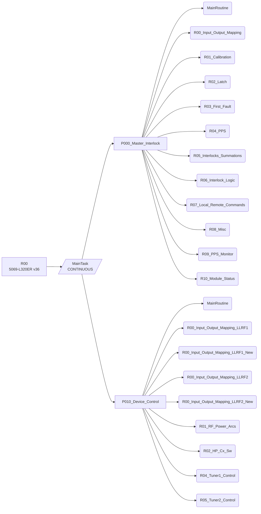
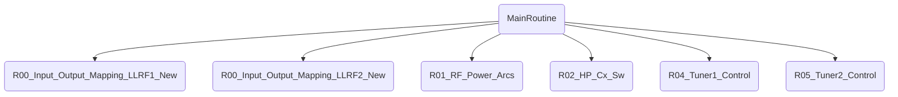

<!-- generated by lf docs build from the R00 spec (spec 16b3f30f4ab13fee) on 2026-09-28; do not edit, change the spec and rebuild -->

# R00 - tasks, programs and routines

## Structure

## Tasks

| Task | Type | Rate ms | Priority | Watchdog ms | Programs | Description |
|---|---|---|---|---|---|---|
| MainTask | CONTINUOUS |  | 10 | 500 | P000_Master_Interlock, P010_Device_Control |  |

## Program P000_Master_Interlock

Main routine `MainRoutine`.

| Routine | Language | Size | Calls | Description |
|---|---|---|---|---|
| MainRoutine | ST | 74 lines | R00_Input_Output_Mapping, R01_Calibration, R02_Latch, R03_First_Fault, R04_PPS, R05_Interlocks_Summations, R06_Interlock_Logic, R07_Local_Remote_Commands, R08_Misc, R09_PPS_Monitor, R10_Module_Status |  |
| R00_Input_Output_Mapping | ST | 1337 lines |  | This routine maps module inputs to PLC tags |
| R01_Calibration | ST | 320 lines |  |  |
| R02_Latch | ST | 704 lines |  | Latches all the fault signals |
| R03_First_Fault | ST | 563 lines |  | Latches all the fault signals |
| R04_PPS | RLL | 16 rungs |  | Process digital inputs to generate required status bits |
| R05_Interlocks_Summations | RLL | 25 rungs |  | Summray signals for latched status of sub systems |
| R06_Interlock_Logic | RLL | 16 rungs |  | Latch Summary Status for  interlocks and permits |
| R07_Local_Remote_Commands | RLL | 8 rungs |  | This routine evaluates internal system state commands based on EPICS / HMI commands |
| R08_Misc | RLL | 22 rungs |  |  |
| R09_PPS_Monitor | ST | 14 lines |  |  |
| R10_Module_Status | ST | 62 lines |  | This routine checks the module/communication status |

```mermaid
flowchart TD
  MainRoutine(MainRoutine) --> R00_Input_Output_Mapping(R00_Input_Output_Mapping)
  MainRoutine(MainRoutine) --> R01_Calibration(R01_Calibration)
  MainRoutine(MainRoutine) --> R02_Latch(R02_Latch)
  MainRoutine(MainRoutine) --> R03_First_Fault(R03_First_Fault)
  MainRoutine(MainRoutine) --> R04_PPS(R04_PPS)
  MainRoutine(MainRoutine) --> R05_Interlocks_Summations(R05_Interlocks_Summations)
  MainRoutine(MainRoutine) --> R06_Interlock_Logic(R06_Interlock_Logic)
  MainRoutine(MainRoutine) --> R07_Local_Remote_Commands(R07_Local_Remote_Commands)
  MainRoutine(MainRoutine) --> R08_Misc(R08_Misc)
  MainRoutine(MainRoutine) --> R09_PPS_Monitor(R09_PPS_Monitor)
  MainRoutine(MainRoutine) --> R10_Module_Status(R10_Module_Status)
```

### R04_PPS rung index

| Rung | Comment | Instructions |
|---|---|---|
| 0 | PPS Mode Status | NOP |
| 1 |  | MOVE OTE XIC |
| 2 |  | MOVE OTE XIC |
| 3 |  | MOVE OTE XIC |
| 4 |  | MOVE OTE XIC |
| 5 | Undefined Mode | MOVE OTE XIO |
| 6 | PPS Mode Latched Status | NOP |
| 7 |  | OTE XIC |
| 8 |  | OTE XIC |
| 9 |  | OTE XIC |
| 10 |  | OTE XIC |
| 11 | PPS Interlock chain | NOP |
| 12 |  | OTE XIC |
| 13 | Output to PPS (probably the PPS interface chassis) for each HP Coax Switch in Dummy Load position | NOP |
| 14 |  | OTE XIC |
| 15 |  | OTE XIC |

### R05_Interlocks_Summations rung index

| Rung | Comment | Instructions |
|---|---|---|
| 0 | MPS & Vacuum interlock chain | NOP |
| 1 |  | OTE XIC |
| 2 |  | OTE XIC |
| 3 |  | OTE XIC |
| 4 |  | OTE XIC |
| 5 | Feeder interlock chain | NOP |
| 6 |  | OTE XIC |
| 7 |  | OTE XIC |
| 8 |  | OTE XIC XIO |
| 9 |  | OTE XIC XIO |
| 10 | Cavity interlock chain | NOP |
| 11 |  | OTE XIC |
| 12 |  | OTE XIC |
| 13 |  | OTE XIC |
| 14 |  | OTE XIC XIO |
| 15 |  | OTE XIC |
| 16 |  | OTE XIC |
| 17 |  | OTE XIC |
| 18 |  | OTE XIC |
| 19 |  | OTE XIC XIO |
| 20 |  | OTE XIC |
| 21 | Auxilliary interlocks - Power and Communication | NOP |
| 22 |  | OTE XIC |
| 23 |  | OTE XIC |
| 24 |  | OTE XIC |

### R06_Interlock_Logic rung index

| Rung | Comment | Instructions |
|---|---|---|
| 0 | External interlocks | NOP |
| 1 |  | OTE XIC XIO |
| 2 | Internal interlocks | NOP |
| 3 |  | EQ OTE XIC |
| 4 |  | EQ OTE XIC |
| 5 |  | OTE XIC |
| 6 |  | OTE XIC XIO |
| 7 |  | OTE XIC |
| 8 |  | OTE XIC XIO |
| 9 |  | NOP |
| 10 |  | OTE XIC |
| 11 |  | OTE XIC |
| 12 |  | OTE XIC |
| 13 |  | OTE XIC |
| 14 |  | OTE XIC |
| 15 |  | OTE XIC |

### R07_Local_Remote_Commands rung index

| Rung | Comment | Instructions |
|---|---|---|
| 0 | ### Commands for system states ### | NOP |
| 1 | ARRF1 Transmit On Command | OTE XIC XIO |
| 2 | ARRF1 Transmit Off Command | OTE XIC |
| 3 | ARRF 2 Transmit On Command | OTE XIC XIO |
| 4 | ARRF 2 Transmit Off Command | OTE XIC |
| 5 | ### Timer for Reset command ### | NOP |
| 6 | Timer for Reset command to provide ample time for fault resets | TOF XIC |
| 7 |  | OTE XIC |

### R08_Misc rung index

| Rung | Comment | Instructions |
|---|---|---|
| 0 | Beam Status Output to MPSG | NOP |
| 1 |  | OTE XIC XIO |
| 2 |  | OTE XIC XIO |
| 3 | Test Mode Active output to RF Drive Control Chassis | NOP |
| 4 |  | OTE XIC |
| 5 | Tuner Controller Power Supply On/Off Control | NOP |
| 6 |  | OTL XIC |
| 7 |  | OTU XIC |
| 8 |  | OTE XIC |
| 9 |  | OTL XIC |
| 10 |  | OTU XIC |
| 11 |  | OTE XIC |
| 12 | Coupler Air Blower On/Off Control | NOP |
| 13 |  | OTL XIC |
| 14 |  | OTU XIC |
| 15 |  | OTE XIC |
| 16 |  | OTL XIC |
| 17 |  | OTU XIC |
| 18 |  | OTE XIC |
| 19 |  | NOP |
| 20 |  | CPT |
| 21 |  | CPT |

## Program P010_Device_Control

Main routine `MainRoutine`.

| Routine | Language | Size | Calls | Description |
|---|---|---|---|---|
| MainRoutine | ST | 41 lines | R00_Input_Output_Mapping_LLRF1_New, R00_Input_Output_Mapping_LLRF2_New, R01_RF_Power_Arcs, R02_HP_Cx_Sw, R04_Tuner1_Control, R05_Tuner2_Control |  |
| R00_Input_Output_Mapping_LLRF1 | ST | 572 lines |  | This routine maps module inputs to PLC tags |
| R00_Input_Output_Mapping_LLRF1_New | ST | 644 lines |  |  |
| R00_Input_Output_Mapping_LLRF2 | ST | 572 lines |  | This routine maps module inputs to PLC tags |
| R00_Input_Output_Mapping_LLRF2_New | ST | 644 lines |  |  |
| R01_RF_Power_Arcs | ST | 254 lines |  |  |
| R02_HP_Cx_Sw | RLL | 20 rungs |  |  |
| R04_Tuner1_Control | RLL | 32 rungs |  |  |
| R05_Tuner2_Control | RLL | 32 rungs |  |  |

### R02_HP_Cx_Sw rung index

| Rung | Comment | Instructions |
|---|---|---|
| 0 | Position status of high power RF Coaxial Switches | NOP |
| 1 |  | OTE XIC XIO |
| 2 |  | OTE XIC XIO |
| 3 |  | OTE XIC XIO |
| 4 |  | OTE XIC XIO |
| 5 | Match compatibility between HP Coax position & PPS mode | NOP |
| 6 |  | OTE XIC |
| 7 |  | OTE XIC |
| 8 |  | NOP |
| 9 | Disable switch movement if in Transmit mode | OTE XIC XIO |
| 10 |  | OTE XIC XIO |
| 11 |  | OTL XIC |
| 12 |  | OTE XIC XIO |
| 13 |  | OTU XIC |
| 14 |  | NOP |
| 15 | Disable switch movement if in Transmit mode | OTE XIC XIO |
| 16 |  | OTE XIC XIO |
| 17 |  | OTL XIC |
| 18 |  | OTE XIC XIO |
| 19 |  | OTU XIC |

### R04_Tuner1_Control rung index

| Rung | Comment | Instructions |
|---|---|---|
| 0 | Tuner Commands via imported SD4840E2 AOIs | NOP |
| 1 |  | AMCI_SD4840E2_Hold XIC |
| 2 |  | TON XIC XIO |
| 3 |  | AMCI_SD4840E2_Immediate_Stop XIC |
| 4 |  | AMCI_SD4840E2_Resume XIC |
| 5 |  | AMCI_SD4840E2_Preset_Motor_Position XIC |
| 6 | Reset errors if error occurs or move is complete | NOP |
| 7 |  | OTE XIC |
| 8 |  | AMCI_SD4840E2_Reset_Errors XIC |
| 9 | Home to position '0' if the CCW microswitch activates | NOP |
| 10 |  | OSR XIC |
| 11 |  | AMCI_SD4840E2_Preset_Motor_Position XIC |
| 12 | Parked status representing non-resonance region | NOP |
| 13 |  | LIMIT OTE |
| 14 | Soft range status | NOP |
| 15 |  | GE OTE |
| 16 |  | LE OTE |
| 17 |  | OTE XIC |
| 18 | Position Control | NOP |
| 19 |  | AMCI_SD4840E2_Absolute_Move XIC XIO |
| 20 |  | AMCI_SD4840E2_Relative_Move XIC XIO |
| 21 |  | AMCI_SD4840E2_Jog_CW XIC XIO |
| 22 |  | AMCI_SD4840E2_Jog_CCW XIC XIO |
| 23 | Resonance control | NOP |
| 24 |  | PID XIC |
| 25 |  | LT OTE TON XIC |
| 26 |  | AMCI_SD4840E2_Hold XIC |
| 27 |  | LT TON XIC |
| 28 |  | AMCI_SD4840E2_Jog_CW XIC |
| 29 |  | GT TON XIC |
| 30 |  | AMCI_SD4840E2_Jog_CCW XIC |
| 31 |  | CPT XIC |

### R05_Tuner2_Control rung index

| Rung | Comment | Instructions |
|---|---|---|
| 0 | Tuner Commands via imported SD4840E2 AOIs | NOP |
| 1 |  | AMCI_SD4840E2_Hold XIC |
| 2 |  | TON XIC XIO |
| 3 |  | AMCI_SD4840E2_Immediate_Stop XIC |
| 4 |  | AMCI_SD4840E2_Resume XIC |
| 5 |  | AMCI_SD4840E2_Preset_Motor_Position XIC |
| 6 | Reset errors if error occurs or move is complete | NOP |
| 7 |  | OTE XIC |
| 8 |  | AMCI_SD4840E2_Reset_Errors XIC |
| 9 | Home to position '0' if the CCW microswitch activates | NOP |
| 10 |  | OSR XIC |
| 11 |  | AMCI_SD4840E2_Preset_Motor_Position XIC |
| 12 | Parked status representing non-resonance region | NOP |
| 13 |  | LIMIT OTE |
| 14 | Soft range status | NOP |
| 15 |  | GE OTE |
| 16 |  | LE OTE |
| 17 |  | OTE XIC |
| 18 | Position Control | NOP |
| 19 |  | AMCI_SD4840E2_Absolute_Move XIC XIO |
| 20 |  | AMCI_SD4840E2_Relative_Move XIC XIO |
| 21 |  | AMCI_SD4840E2_Jog_CW XIC XIO |
| 22 |  | AMCI_SD4840E2_Jog_CCW XIC XIO |
| 23 | Resonance control | NOP |
| 24 |  | PID XIC |
| 25 |  | LT OTE TON XIC |
| 26 |  | AMCI_SD4840E2_Hold XIC |
| 27 |  | LT TON XIC |
| 28 |  | AMCI_SD4840E2_Jog_CW XIC |
| 29 |  | GT TON XIC |
| 30 |  | AMCI_SD4840E2_Jog_CCW XIC |
| 31 |  | CPT XIC |

## Program PowerUpProgram

Main routine `PowerUp`.

| Routine | Language | Size | Calls | Description |
|---|---|---|---|---|
| PowerUp | ST | 17 lines |  |  |

## Add-On Instruction logic

| AOI | Routine | Language | Size | Description |
|---|---|---|---|---|
| AMCI_SD4840E2_Absolute_Move | EnableInFalse | RLL | 1 rungs |  |
| AMCI_SD4840E2_Absolute_Move | Logic | RLL | 14 rungs |  |
| AMCI_SD4840E2_Axis_Follower_Circular | EnableInFalse | RLL | 1 rungs |  |
| AMCI_SD4840E2_Axis_Follower_Circular | Logic | RLL | 14 rungs |  |
| AMCI_SD4840E2_Axis_Follower_Linear | EnableInFalse | RLL | 1 rungs |  |
| AMCI_SD4840E2_Axis_Follower_Linear | Logic | RLL | 14 rungs |  |
| AMCI_SD4840E2_Disable_Driver | Logic | RLL | 2 rungs |  |
| AMCI_SD4840E2_Enable_Driver | Logic | RLL | 3 rungs |  |
| AMCI_SD4840E2_Hold | Logic | RLL | 1 rungs |  |
| AMCI_SD4840E2_Home_CCW | EnableInFalse | RLL | 1 rungs |  |
| AMCI_SD4840E2_Home_CCW | Logic | RLL | 14 rungs |  |
| AMCI_SD4840E2_Home_CW | EnableInFalse | RLL | 1 rungs |  |
| AMCI_SD4840E2_Home_CW | Logic | RLL | 14 rungs |  |
| AMCI_SD4840E2_Immediate_Stop | Logic | RLL | 4 rungs |  |
| AMCI_SD4840E2_Jog_CCW | EnableInFalse | RLL | 1 rungs |  |
| AMCI_SD4840E2_Jog_CCW | Logic | RLL | 13 rungs |  |
| AMCI_SD4840E2_Jog_CW | EnableInFalse | RLL | 1 rungs |  |
| AMCI_SD4840E2_Jog_CW | Logic | RLL | 13 rungs |  |
| AMCI_SD4840E2_Preset_Encoder_Position | Logic | RLL | 5 rungs |  |
| AMCI_SD4840E2_Preset_Motor_Position | Logic | RLL | 5 rungs |  |
| AMCI_SD4840E2_Program_Assembed_Move | Logic | RLL | 22 rungs |  |
| AMCI_SD4840E2_Program_Motor_Current | Logic | RLL | 5 rungs |  |
| AMCI_SD4840E2_Registration_Move_CCW | EnableInFalse | RLL | 1 rungs |  |
| AMCI_SD4840E2_Registration_Move_CCW | Logic | RLL | 12 rungs |  |
| AMCI_SD4840E2_Registration_Move_CW | EnableInFalse | RLL | 1 rungs |  |
| AMCI_SD4840E2_Registration_Move_CW | Logic | RLL | 12 rungs |  |
| AMCI_SD4840E2_Relative_Move | EnableInFalse | RLL | 1 rungs |  |
| AMCI_SD4840E2_Relative_Move | Logic | RLL | 14 rungs |  |
| AMCI_SD4840E2_Reset_Errors | Logic | RLL | 4 rungs |  |
| AMCI_SD4840E2_Resume | Logic | RLL | 2 rungs |  |
| AMCI_SD4840E2_Run_Blend_Move | EnableInFalse | RLL | 1 rungs |  |
| AMCI_SD4840E2_Run_Blend_Move | Logic | RLL | 12 rungs |  |
| AMCI_SD4840E2_Run_Dwell_Move | EnableInFalse | RLL | 1 rungs |  |
| AMCI_SD4840E2_Run_Dwell_Move | Logic | RLL | 11 rungs |  |
| Calibration_AOI | Logic | ST | 2 lines |  |
| Count_to_kW_AOI | Logic | ST | 20 lines |  |
| FF_AOI | Logic | RLL | 2 rungs |  |
| kW_to_Count_AOI | Logic | ST | 26 lines |  |
| Latch_ai_AOI | Logic | RLL | 3 rungs |  |
| Latch_AOI | Logic | RLL | 1 rungs |  |
| Latch_bi_AOI | Logic | RLL | 1 rungs |  |
| Module_Status_AOI | Logic | ST | 23 lines |  |
