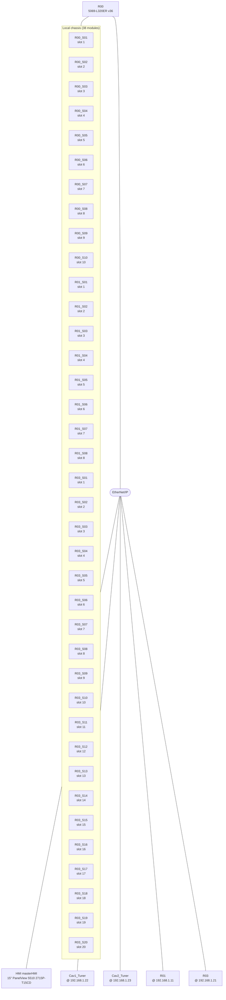

<!-- generated by lf docs build from the R00 spec (spec 16b3f30f4ab13fee) on 2026-09-28; do not edit, change the spec and rebuild -->

# R00 - system overview

Inventory and architecture derived from the project. The purpose of the system, the process it controls and the operating philosophy are described in SPEC.md; this document says what the system is made of and how it is connected.

## 1. Identification

| Item | Value |
|---|---|
| Controller | `R00` |
| Processor | 5069-L320ER |
| Firmware / Logix version | v36.11 (software 36.00) |
| Safety controller | no |
| Description | AR RF Master Interlock PLC code |
| Handler programs | power-loss `PowerUpProgram`, major-fault `-` |
| HMI | masterHMI on 15" PanelView 5510 2715P-T15CD; home screen `HOME` |
| Size | 25 UDTs, 30 AOIs, 42 modules, 49 controller tags, 3 programs / 22 routines, 1 tasks, 0 alarms |

## 2. Architecture

## 3. Hardware inventory

| Module | Catalog | Parent | Slot | IP address | Rev | Description |
|---|---|---|---|---|---|---|
| Cav1_Tuner |  | Local |  | 192.168.1.22 | 1.1 |  |
| Cav2_Tuner |  | Local |  | 192.168.1.23 | 1.1 |  |
| R01 |  | Local |  | 192.168.1.11 | 1.1 |  |
| R03 |  | Local |  | 192.168.1.21 | 1.1 |  |
| R00_S01 |  | Local | 1 |  | 1.1 |  |
| R01_S01 |  | Local | 1 |  | 1.1 |  |
| R03_S01 |  | Local | 1 |  | 1.1 |  |
| R00_S02 |  | Local | 2 |  | 1.1 |  |
| R01_S02 |  | Local | 2 |  | 1.1 |  |
| R03_S02 |  | Local | 2 |  | 1.1 |  |
| R00_S03 |  | Local | 3 |  | 1.1 |  |
| R01_S03 |  | Local | 3 |  | 1.1 |  |
| R03_S03 |  | Local | 3 |  | 1.1 |  |
| R00_S04 |  | Local | 4 |  | 1.1 |  |
| R01_S04 |  | Local | 4 |  | 1.1 |  |
| R03_S04 |  | Local | 4 |  | 1.1 |  |
| R00_S05 |  | Local | 5 |  | 1.1 |  |
| R01_S05 |  | Local | 5 |  | 1.1 |  |
| R03_S05 |  | Local | 5 |  | 1.1 |  |
| R00_S06 |  | Local | 6 |  | 1.1 |  |
| R01_S06 |  | Local | 6 |  | 1.1 |  |
| R03_S06 |  | Local | 6 |  | 1.1 |  |
| R00_S07 |  | Local | 7 |  | 1.1 |  |
| R01_S07 |  | Local | 7 |  | 1.1 |  |
| R03_S07 |  | Local | 7 |  | 1.1 |  |
| R00_S08 |  | Local | 8 |  | 1.1 |  |
| R01_S08 |  | Local | 8 |  | 1.1 |  |
| R03_S08 |  | Local | 8 |  | 1.1 |  |
| R00_S09 |  | Local | 9 |  | 1.1 |  |
| R03_S09 |  | Local | 9 |  | 1.1 |  |
| R00_S10 |  | Local | 10 |  | 1.1 |  |
| R03_S10 |  | Local | 10 |  | 1.1 |  |
| R03_S11 |  | Local | 11 |  | 1.1 |  |
| R03_S12 |  | Local | 12 |  | 1.1 |  |
| R03_S13 |  | Local | 13 |  | 1.1 |  |
| R03_S14 |  | Local | 14 |  | 1.1 |  |
| R03_S15 |  | Local | 15 |  | 1.1 |  |
| R03_S16 |  | Local | 16 |  | 1.1 |  |
| R03_S17 |  | Local | 17 |  | 1.1 |  |
| R03_S18 |  | Local | 18 |  | 1.1 |  |
| R03_S19 |  | Local | 19 |  | 1.1 |  |
| R03_S20 |  | Local | 20 |  | 1.1 |  |

Count by catalog number:  x42.

## 4. Networks and communication interfaces

| Device | Catalog | IP address | Role |
|---|---|---|---|
| Cav1_Tuner |  | 192.168.1.22 | EtherNet/IP device |
| Cav2_Tuner |  | 192.168.1.23 | EtherNet/IP device |
| R01 |  | 192.168.1.11 | EtherNet/IP device |
| R03 |  | 192.168.1.21 | EtherNet/IP device |

| Instruction | Used in |
|---|---|
| GSV | PowerUpProgram/PowerUp |
| SSV | PowerUpProgram/PowerUp |

## 5. Control software

| Task | Type | Rate | Programs (routines) |
|---|---|---|---|
| MainTask | CONTINUOUS | - | P000_Master_Interlock (12), P010_Device_Control (9) |

Add-On Instructions: 30 (8 project/site, 22 vendor). Details in TAGS.md and ROUTINES.md.
User-defined data types: FaultRecord, On_Off_Control, UDT_ai, UDT_AirBlower, UDT_ArcDetector, UDT_bi, UDT_Cavity, UDT_DriveControl, UDT_Feeder, UDT_HP_Coax_SW, UDT_HPA, UDT_LLRF, UDT_LLRF_ANLG, UDT_LLRF_DIG, UDT_Local_Remote, UDT_Module_Connection, UDT_Module_Status, UDT_Modules, UDT_MPS, UDT_PPS, UDT_RF_Power_Ch, UDT_System, UDT_TCU, UDT_Tuner, UDT_Vacuum.

## 6. Operator interface

HMI project `masterHMI` on 15" PanelView 5510 2715P-T15CD: 42 screens in 13 folders, 2 menu shortcuts, 17 Add-On Graphics. Screen hierarchy and navigation in HMI_NAVIGATION.md; tag interface in HMI_TAGS.md.
Controller alarms: none defined in the controller (alarming is external or instruction-based).

## 7. External data interface (controller-scope tags)

Tags other systems (HMI, SCADA/EPICS, peer controllers) can address. Program-scope tags are not externally addressable by most clients.

| Tag | Type | Dim | External access | Description |
|---|---|---|---|---|
| Cav1 | UDT_Cavity |  | Read/Write | Cavity 1 |
| Cav2 | UDT_Cavity |  | Read/Write | Cavity 2 |
| DrvCtrl1 | UDT_DriveControl |  | Read/Write | RF Drive Control 1 |
| DrvCtrl2 | UDT_DriveControl |  | Read/Write | RF Drive Control 2 |
| EPICS | UDT_Local_Remote |  | Read/Write | EPICS |
| Feeder1 | UDT_Feeder |  | Read/Write |  |
| Feeder2 | UDT_Feeder |  | Read/Write |  |
| HMI | UDT_Local_Remote |  | Read/Write | HMI |
| HPA1 | UDT_HPA |  | Read/Write | HPA 1 |
| HPA2 | UDT_HPA |  | Read/Write | HPA 2 |
| HP_Cx_Sw1 | UDT_HP_Coax_SW |  | Read/Write | High Power RF Switch 1 |
| HP_Cx_Sw2 | UDT_HP_Coax_SW |  | Read/Write | High Power RF Switch 2 |
| LLRF1 | UDT_LLRF |  | Read/Write | LLRF Controller 1 |
| LLRF1_Arc_Detector | UDT_ArcDetector | 3 | Read/Write |  |
| LLRF1_Arc_Detector_Ltch | INT |  | Read/Write |  |
| LLRF1_Arc_Detector_Sts | INT |  | Read/Write |  |
| LLRF1_Power | UDT_RF_Power_Ch | 10 | Read/Write |  |
| LLRF1_Power_Byp | INT | 2 10 | Read/Write |  |
| LLRF1_Power_Hi_SP | REAL | 2 10 | Read/Write |  |
| LLRF1_Power_Intlk_Mode | INT | 2 10 | Read/Write |  |
| LLRF1_Power_Lo_SP | REAL | 2 10 | Read/Write |  |
| LLRF1_Power_Phase | REAL | 10 | Read/Write |  |
| LLRF1_Power_Sum | BOOL |  | Read/Write |  |
| LLRF2 | UDT_LLRF |  | Read/Write | LLRF Controller 2 |
| LLRF2_Arc_Detector | UDT_ArcDetector | 3 | Read/Write |  |
| LLRF2_Arc_Detector_Ltch | INT |  | Read/Write |  |
| LLRF2_Arc_Detector_Sts | INT |  | Read/Write |  |
| LLRF2_Power | UDT_RF_Power_Ch | 10 | Read/Write |  |
| LLRF2_Power_Byp | INT | 2 10 | Read/Write |  |
| LLRF2_Power_Hi_SP | REAL | 2 10 | Read/Write |  |
| LLRF2_Power_Intlk_Mode | INT | 2 10 | Read/Write |  |
| LLRF2_Power_Lo_SP | REAL | 2 10 | Read/Write |  |
| LLRF2_Power_Phase | REAL | 10 | Read/Write |  |
| LLRF2_Power_Sum | BOOL |  | Read/Write |  |
| Local_RF_OFF | UDT_bi |  | Read/Write |  |
| Main_LCWR_Pressure | UDT_ai |  | Read/Write |  |
| Main_LCWR_Temp | UDT_ai |  | Read/Write |  |
| Main_LCWS_Pressure | UDT_ai |  | Read/Write |  |
| Main_LCWS_Temp | UDT_ai |  | Read/Write |  |
| Modules | UDT_Modules |  | Read/Write |  |
| MPS | UDT_MPS |  | Read/Write | AR Global MPS |
| PPS | UDT_PPS |  | Read/Write | PSS |
| RF_Power_Editing_Mode | INT |  | Read/Write |  |
| RF_Power_Editing_Mode_Prev | INT |  | Read/Write |  |
| System | UDT_System |  | Read/Write | ARRF 1&2 |
| Tuner1 | UDT_Tuner |  | Read/Write | Cavity Tuner 1 |
| Tuner2 | UDT_Tuner |  | Read/Write | Cavity Tuner 2 |
| TunerPot_PS | UDT_bi |  | Read/Write |  |
| Vacuum | UDT_Vacuum |  | Read/Write |  |

## 8. Document set

Generated documents:

| File | Content |
|---|---|
| SPEC.md | functional description (hand-written) |
| IO_LIST.md | modules and I/O points |
| IO_LIST.csv | I/O points (spreadsheet) |
| TAGS.md | UDTs, AOIs, tags |
| ROUTINES.md | task/program/routine map |
| INTERLOCKS.md | cause and effect from the logic |
| HMI_TAGS.md | HMI tag interface |
| TEST_PLAN.md | test plan skeleton |
| HMI_NAVIGATION.md | HMI screen hierarchy and navigation |
| SYSTEM.md | this overview |
| README.md | index |
